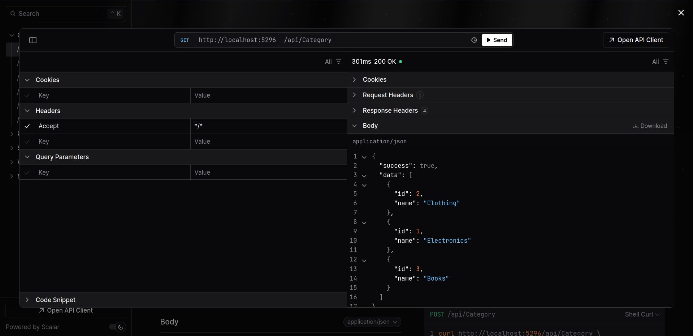
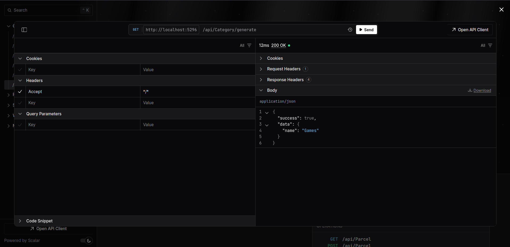
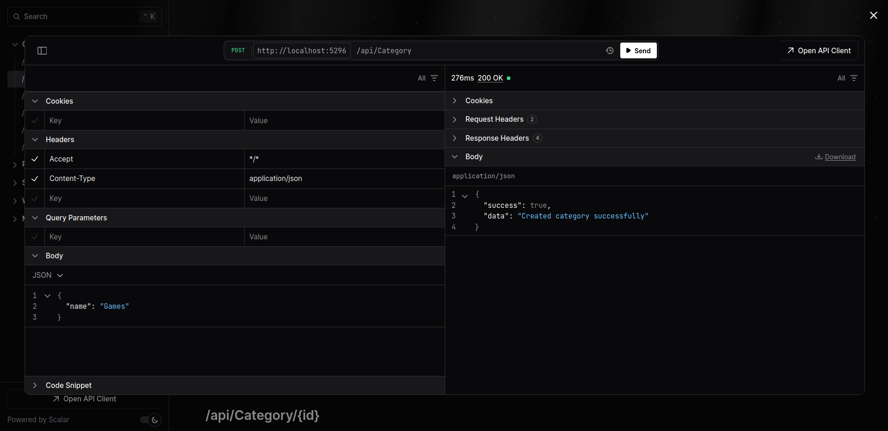
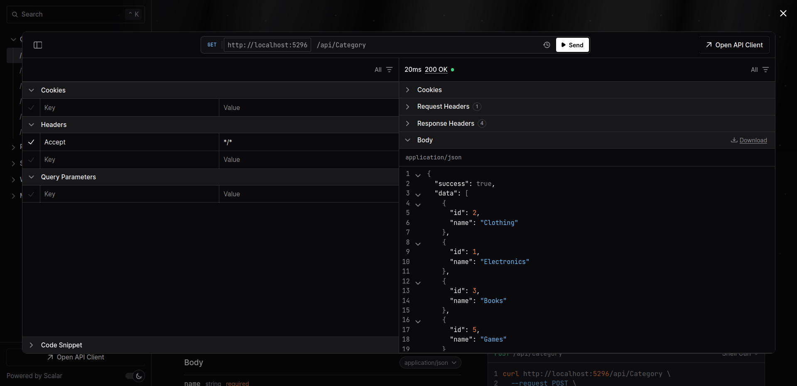
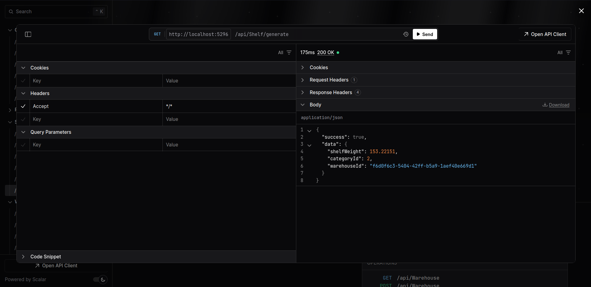
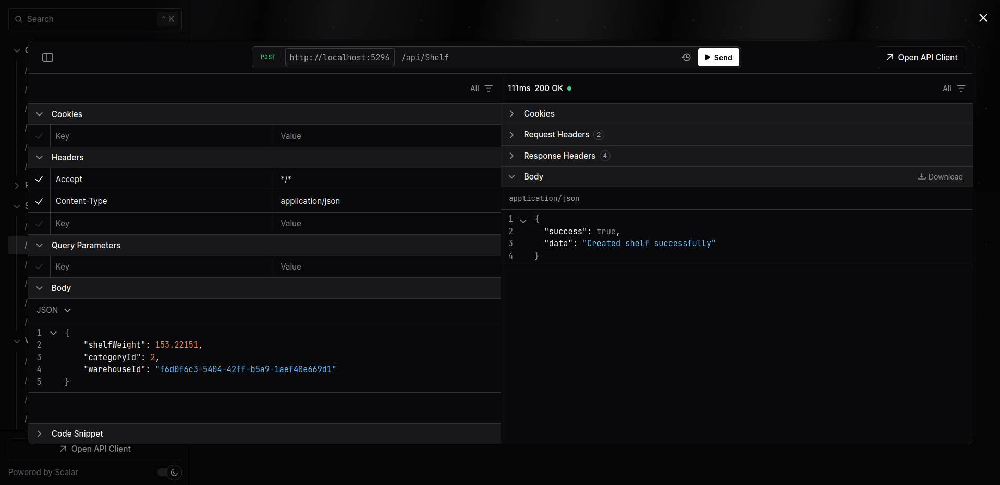
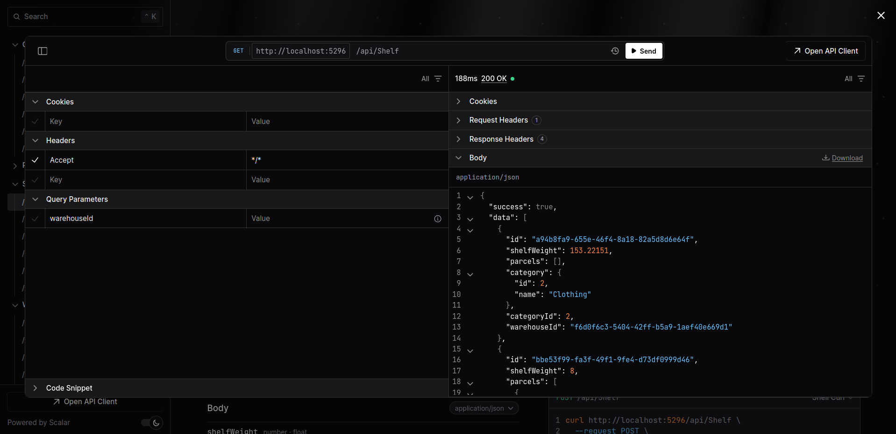
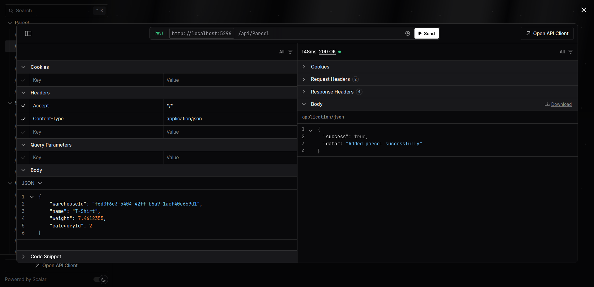
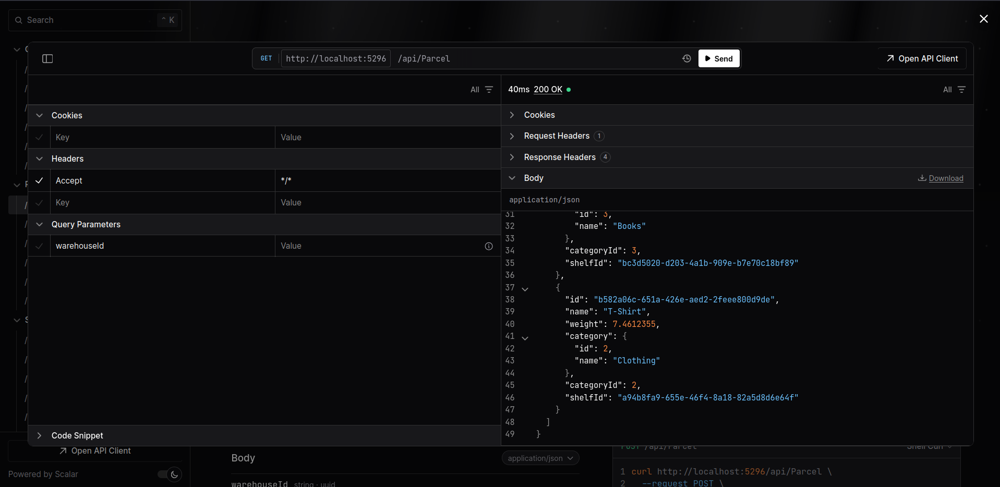

# 🗃️ WareCore — минималистичное API-хранилище посылок по категориям и весу

**WareCore** — это ASP.NET Core Web API для управления складом, полками и посылками с логикой автоподбора полки на основе веса и категории. Также реализован генератор JSON-данных с использованием Bogus. Проект был создан за 9 часов в рамках хакатона и стал моим первым опытом участия.

---

## 📦 Идея

Идея проекта — реализовать систему хранения посылок в контексте "склада":
- склады состоят из полок,
- полки имеют ограничение по весу и категорию,
- посылки должны попадать только на подходящие полки.

Реализована логика, позволяющая системе самостоятельно определять, на какую полку отправить новую посылку, исходя из её категории и веса. Это простая симуляция логистического движка.

---

## ⚙️ Реализация

**Технологический стек**:

- ASP.NET Core Web API
- PostgreSQL
- Entity Framework Core
- FluentValidation
- Scalar (альтернатива Swagger)
- Bogus (генерация фейковых данных)

**Основной функционал**:

- CRUD для:
  - Складов (Warehouses)
  - Полок (Shelves)
  - Категорий (Categories)
  - Посылок (Parcels)

- /generate — генерация JSON-данных для быстрого POST-запроса внутри каждого контроллера.
- Валидация входных данных с помощью `FluentValidation`

---

## 💡 Интересная особенность

Добавление посылки — это не просто `POST`. Это полноценный сценарий:

1. Пользователь отправляет посылку в конкретный склад.
2. Система определяет возможные полки с подходящей категорией и достаточным остатком по весу.
3. Система размещает посылку на наиболее подходящей полке.

---

## 🛠 Что не успел сделать

Планировалась фоновая задача на базе **Quartz.NET** для оптимизации размещения посылок на полках:

- Сортировка полок и посылок по весу.
- Перекладка мелких посылок на менее загруженные полки.
- Учет категорий для правильного размещения.

---

## 💭 Впечатления

Мне понравилось участвовать в хакатоне — это был мой первый опыт.  
Проект получился логичным, с чистой архитектурой и работающей бизнес-логикой.  
Хочется больше времени на доработку и реализацию более оригинальных идей, но результатом я доволен.

---

## 🚀 Как запустить

**Клонирование репозитория**:

```bash
git clone https://github.com/BloodyAngel22/WareCore.git

cd WareCore
```

**Запуск контейнера с postgres**:
```bash
docker run --name warecore-postgres -p 5432:5432 -e POSTGRES_PASSWORD=postgres -d postgres
```

**Запуск проекта**:

```bash
cd backend

dotnet run --project backend.WebApi
```

или с помощью IDE.

---

## 🧪 Документация и тесты

[Документация доступна по адресу](http://localhost:5296/docs/)

---

> P.S. Кирилл, благодарю за интересную задачу. Было приятно участвовать и проверить свои силы.

---

## Демонстрация работы

















